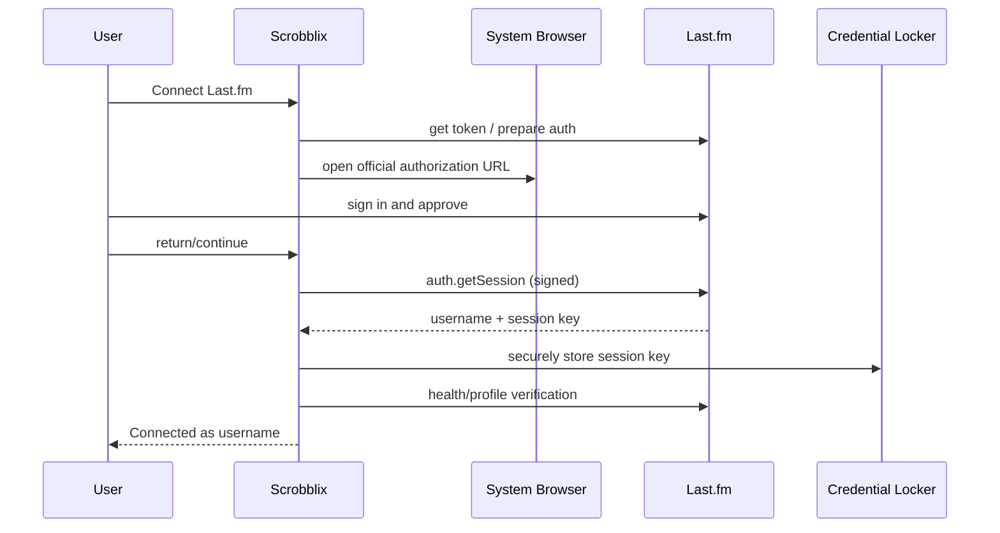

# Last.fm Authentication Sequence

```mermaid
sequenceDiagram
  participant U as User
  participant App as Scrobblix
  participant B as System Browser
  participant L as Last.fm
  participant C as Credential Locker
  U->>App: Connect Last.fm
  App->>L: get token / prepare auth
  App->>B: open official authorization URL
  U->>L: sign in and approve
  U->>App: return/continue
  App->>L: auth.getSession (signed)
  L-->>App: username + session key
  App->>C: securely store session key
  App->>L: health/profile verification
  App-->>U: Connected as username
```
