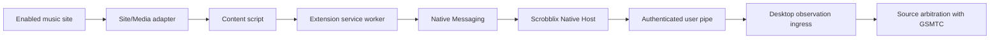

# Browser Companion Flow

```mermaid
flowchart LR
  Page[Enabled music site] --> Adapter[Site/Media adapter]
  Adapter --> Content[Content script]
  Content --> Worker[Extension service worker]
  Worker --> NM[Native Messaging]
  NM --> Host[Scrobblix Native Host]
  Host --> Pipe[Authenticated user pipe]
  Pipe --> Desktop[Desktop observation ingress]
  Desktop --> Arb[Source arbitration with GSMTC]
```
