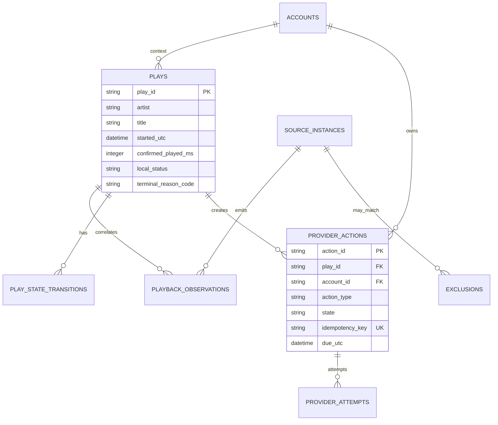

# Database ERD

```mermaid
erDiagram
  ACCOUNTS ||--o{ PLAYS : context
  SOURCE_INSTANCES ||--o{ PLAYBACK_OBSERVATIONS : emits
  PLAYS ||--o{ PLAYBACK_OBSERVATIONS : correlates
  PLAYS ||--o{ PLAY_STATE_TRANSITIONS : has
  PLAYS ||--o{ PROVIDER_ACTIONS : creates
  ACCOUNTS ||--o{ PROVIDER_ACTIONS : owns
  PROVIDER_ACTIONS ||--o{ PROVIDER_ATTEMPTS : attempts
  SOURCE_INSTANCES ||--o{ EXCLUSIONS : may_match
  PLAYS {
    string play_id PK
    string artist
    string title
    datetime started_utc
    integer confirmed_played_ms
    string local_status
    string terminal_reason_code
  }
  PROVIDER_ACTIONS {
    string action_id PK
    string play_id FK
    string account_id FK
    string action_type
    string state
    string idempotency_key UK
    datetime due_utc
  }
```
