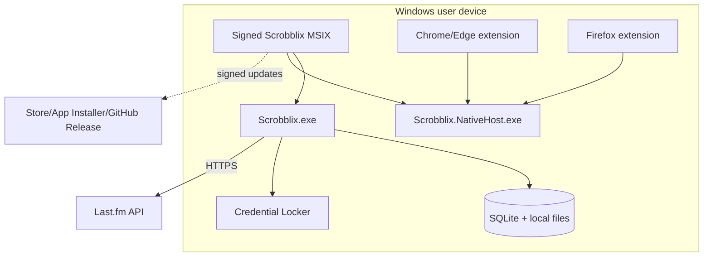

# Deployment Diagram

```mermaid
flowchart TB
  subgraph UserDevice[Windows user device]
    Package[Signed Scrobblix MSIX]
    Main[Scrobblix.exe]
    Native[Scrobblix.NativeHost.exe]
    DB[(SQLite + local files)]
    Locker[Credential Locker]
    Chrome[Chrome/Edge extension]
    Firefox[Firefox extension]
    Package --> Main
    Package --> Native
    Main --> DB
    Main --> Locker
    Chrome --> Native
    Firefox --> Native
  end
  Main -->|HTTPS| LastFM[Last.fm API]
  Package -.signed updates.-> Feed[Store/App Installer/GitHub Release]
```
