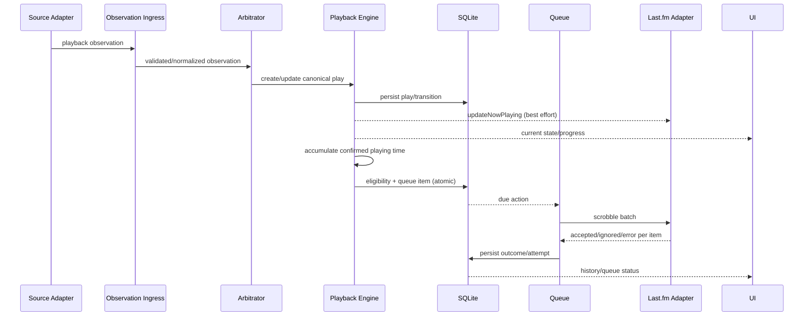

# Playback Sequence

```mermaid
sequenceDiagram
  participant S as Source Adapter
  participant I as Observation Ingress
  participant A as Arbitrator
  participant P as Playback Engine
  participant D as SQLite
  participant Q as Queue
  participant L as Last.fm Adapter
  participant U as UI
  S->>I: playback observation
  I->>A: validated/normalized observation
  A->>P: create/update canonical play
  P->>D: persist play/transition
  P-->>L: updateNowPlaying (best effort)
  P-->>U: current state/progress
  P->>P: accumulate confirmed playing time
  P->>D: eligibility + queue item (atomic)
  D-->>Q: due action
  Q->>L: scrobble batch
  L-->>Q: accepted/ignored/error per item
  Q->>D: persist outcome/attempt
  D-->>U: history/queue status
```
