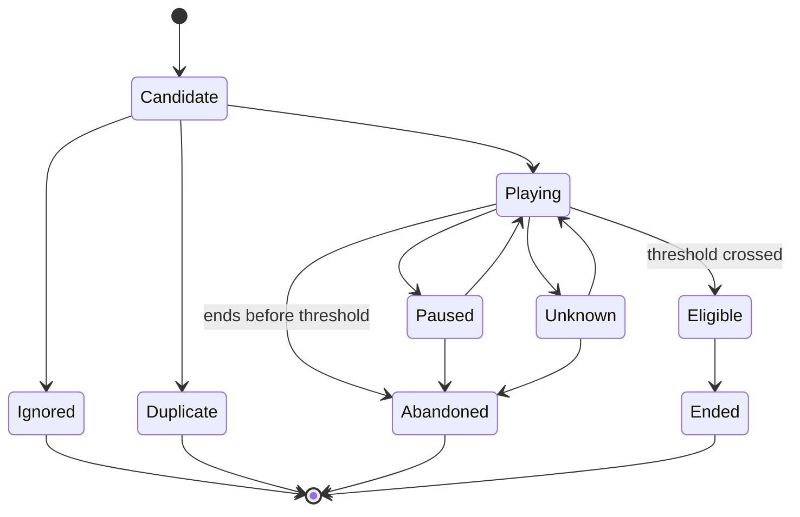

# Play State Diagram

```mermaid
stateDiagram-v2
  [*] --> Candidate
  Candidate --> Playing
  Candidate --> Ignored
  Candidate --> Duplicate
  Playing --> Paused
  Playing --> Unknown
  Paused --> Playing
  Unknown --> Playing
  Playing --> Eligible: threshold crossed
  Playing --> Abandoned: ends before threshold
  Paused --> Abandoned
  Unknown --> Abandoned
  Eligible --> Ended
  Ignored --> [*]
  Duplicate --> [*]
  Abandoned --> [*]
  Ended --> [*]
```
