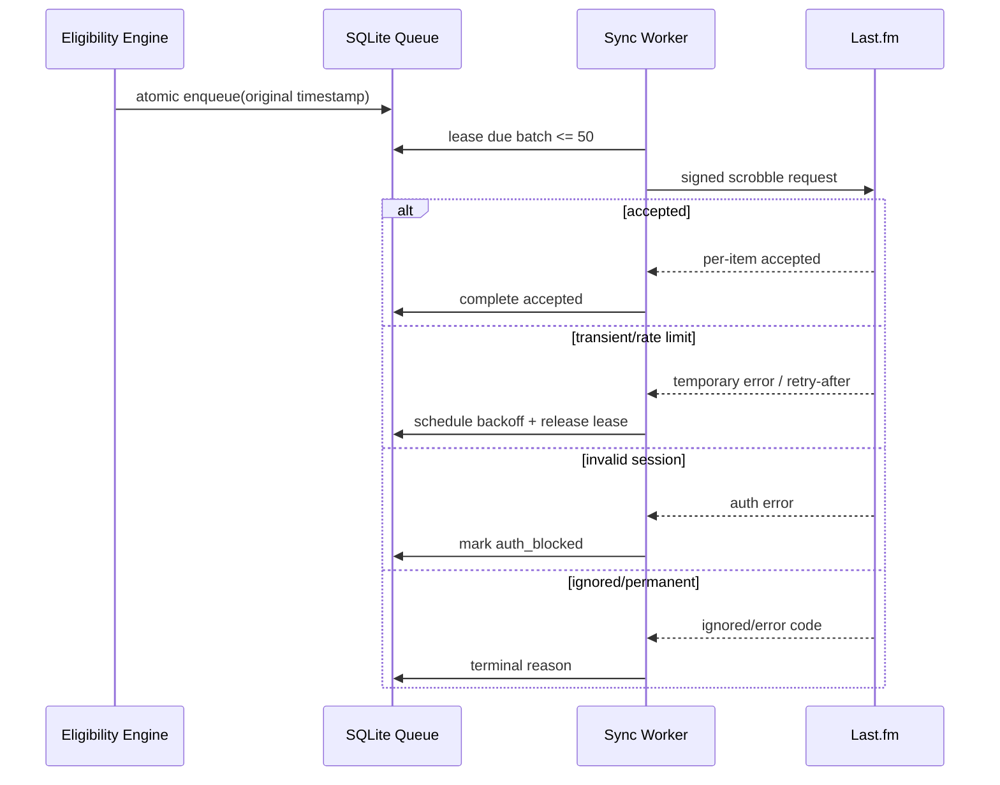

# Queue Retry Sequence

```mermaid
sequenceDiagram
  participant E as Eligibility Engine
  participant DB as SQLite Queue
  participant W as Sync Worker
  participant L as Last.fm
  E->>DB: atomic enqueue(original timestamp)
  W->>DB: lease due batch <= 50
  W->>L: signed scrobble request
  alt accepted
    L-->>W: per-item accepted
    W->>DB: complete accepted
  else transient/rate limit
    L-->>W: temporary error / retry-after
    W->>DB: schedule backoff + release lease
  else invalid session
    L-->>W: auth error
    W->>DB: mark auth_blocked
  else ignored/permanent
    L-->>W: ignored/error code
    W->>DB: terminal reason
  end
```
