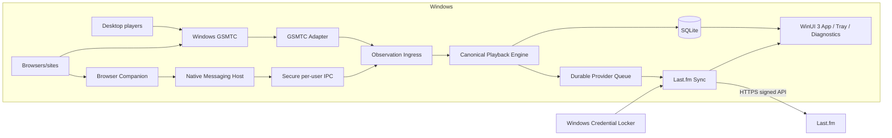

# System Architecture Diagram

```mermaid
flowchart LR
  subgraph Windows
    Players[Desktop players] --> GSMTC[Windows GSMTC]
    Browsers[Browsers/sites] --> GSMTC
    Browsers --> Extension[Browser Companion]
    GSMTC --> Adapter[GSMTC Adapter]
    Extension --> Host[Native Messaging Host]
    Host --> Pipe[Secure per-user IPC]
    Adapter --> Ingress[Observation Ingress]
    Pipe --> Ingress
    Ingress --> Core[Canonical Playback Engine]
    Core --> DB[(SQLite)]
    Core --> Queue[Durable Provider Queue]
    Queue --> Sync[Last.fm Sync]
    DB --> UI[WinUI 3 App / Tray / Diagnostics]
    Sync --> UI
  end
  Sync -->|HTTPS signed API| LastFM[Last.fm]
  Cred[Windows Credential Locker] --> Sync
```
