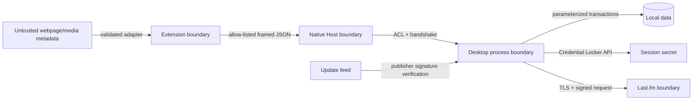

# Trust Boundaries

```mermaid
flowchart LR
  Web[Untrusted webpage/media metadata] -->|validated adapter| Ext[Extension boundary]
  Ext -->|allow-listed framed JSON| Host[Native Host boundary]
  Host -->|ACL + handshake| App[Desktop process boundary]
  App -->|parameterized transactions| DB[(Local data)]
  App -->|Credential Locker API| Secret[Session secret]
  App -->|TLS + signed request| LastFM[Last.fm boundary]
  Feed[Update feed] -->|publisher signature verification| App
```
