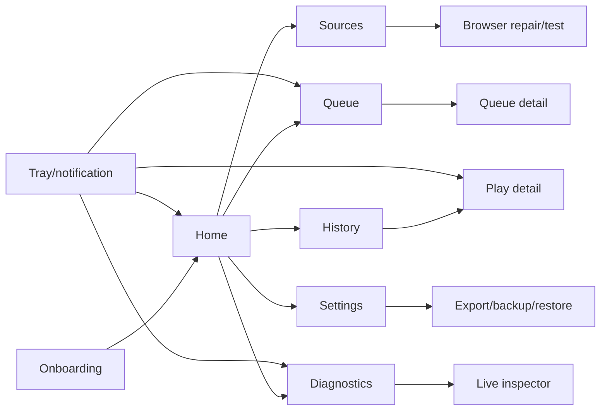

# UI Flow

```mermaid
flowchart LR
  Onboarding --> Home
  Home --> History
  Home --> Queue
  Home --> Diagnostics
  Home --> Sources
  Home --> Settings
  History --> PlayDetail[Play detail]
  Queue --> QueueDetail[Queue detail]
  Diagnostics --> Inspector[Live inspector]
  Sources --> BrowserRepair[Browser repair/test]
  Settings --> Backup[Export/backup/restore]
  Tray[Tray/notification] --> Home
  Tray --> PlayDetail
  Tray --> Queue
  Tray --> Diagnostics
```
